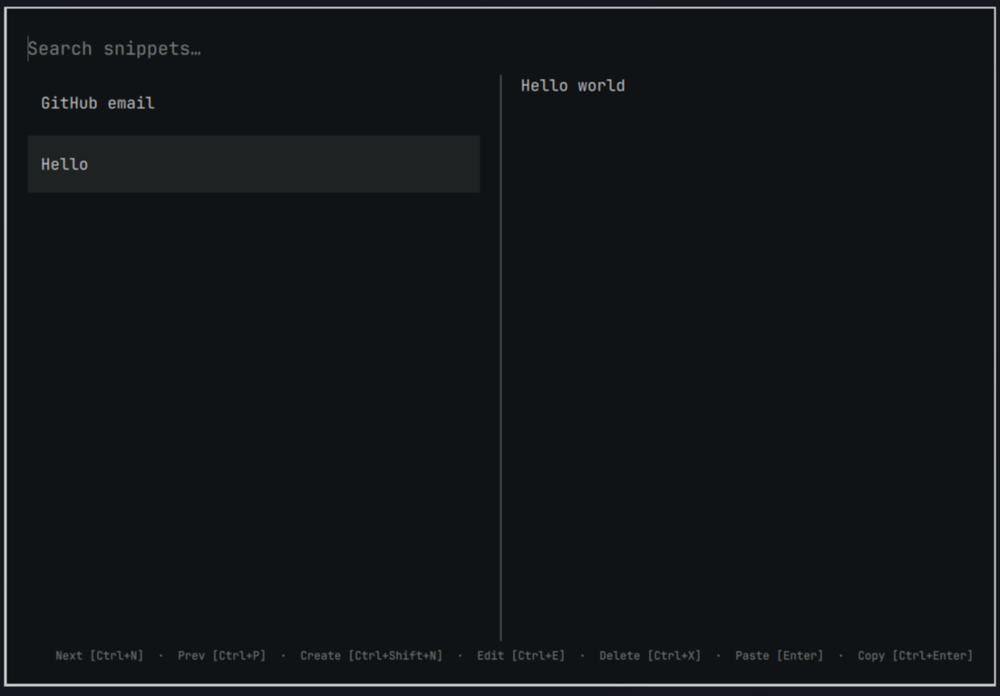

# Snippets

An Omarchy overlay for searching, creating, editing, copying, and pasting personal plain-text snippets. Everything stays local—no account or network service required.



## Install

```bash
omarchy plugin add https://github.com/kewah/omarchy-snippet-manager.git --enable
```

This is the standard Omarchy plugin install command. No additional packages are required on a current Omarchy installation.

## Use

Open the overlay with:

```bash
omarchy-shell shell toggle kewah.snippet-manager
```

Type to search, press `Enter` to paste, or press `Ctrl+Enter` to copy. The overlay shows the shortcuts for creating, editing, deleting, and navigating snippets.

### Menu entry and hotkey

Installing the plugin does not add a menu row or a hotkey. Add those yourself in the usual Omarchy files.

Put **Snippets** under Trigger by editing `~/.config/omarchy/extensions/omarchy-menu.jsonc`. Dotted ids place the row (`trigger.snippets`):

```jsonc
"trigger.snippets": {
  "icon": "",
  "label": "Snippets",
  "action": "omarchy-shell shell toggle kewah.snippet-manager"
}
```

Bind `SUPER + CTRL + M` in `~/.config/hypr/bindings.lua`:

```lua
o.bind("SUPER + CTRL + M", "Snippets", "omarchy-shell shell toggle kewah.snippet-manager")
```

See [Adding your own menu entries](https://omarchy.org/manual/dotfiles/) and [Hotkeys](https://omarchy.org/manual/hotkeys/).

If you prefer a script that makes the same two edits, install Node.js from the Omarchy menu (`Super + Space`) under Install > Development > JavaScript > Node.js, then run:

```bash
~/.config/omarchy/plugins/kewah.snippet-manager/bin/snippet-install \
  --menu-file ~/.config/omarchy/extensions/omarchy-menu.jsonc \
  --bind-file ~/.config/hypr/bindings.lua
```

The script preserves unrelated settings and is safe to run again.

## Remove

```bash
omarchy plugin remove kewah.snippet-manager
```

If you added a menu entry or hotkey, also remove `trigger.snippets` from `~/.config/omarchy/extensions/omarchy-menu.jsonc` and the Snippets binding from `~/.config/hypr/bindings.lua`.

Removing the plugin keeps your snippets in `~/.local/share/omarchy-snippets/` so they are available if you reinstall it.
